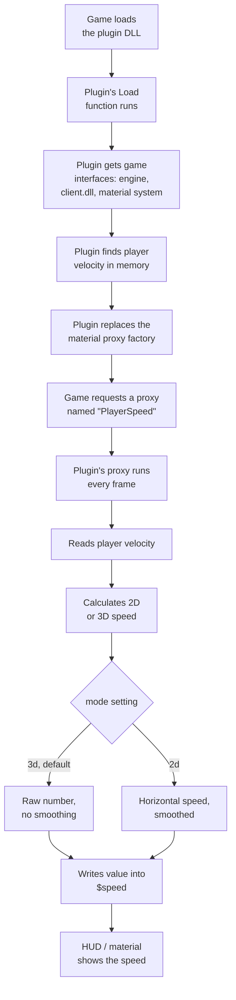

# Architecture

This document explains how the plugin works on the inside, step by step, in plain language.

## Big picture

The plugin is a DLL that the game loads as a **server plugin**. Once loaded, it hooks into the game's material system so it can feed a live speed number, `$speed`, into any material that asks for it.

## Step by step

### 1. Plugin is loaded

Left 4 Dead 2, through Metamod:Source or the engine directly, loads the DLL and calls `CreateInterface`, which hands back the plugin object (`CPlugin`).

### 2. Plugin connects to the game

Inside `Load()`, the plugin grabs a few interfaces from the game so it can talk to it:

- **Engine client interface** — lets the plugin ask "who is the local player?"
- **Client DLL interface** — lets the plugin look at the list of game classes (like `CTerrorPlayer`)
- **Client entity list** — lets the plugin get the actual player entity object
- **Material system interface** — lets the plugin plug into how materials/shaders get their values

> **Note on the material system interface version:** the `hl2sdk` `l4d2` branch's `imaterialsystem.h` header labels itself `VMaterialSystem079`, but the game's actual factory only exposes `VMaterialSystem080` — a different, incompatible layout of the same interface. The plugin asks for `VMaterialSystem080` by name when getting this interface, matching what the game really provides. Because of this mismatch, some methods on this interface are not safe to call directly through the header's normal virtual function calls, even though they compile fine — calling into the wrong method can crash. The plugin currently avoids this by not calling `ReloadMaterials()` (a method that crashed when called directly) and does not depend on any other risky calls on this interface either.

### 3. Finding the velocity in memory

The player's velocity (`m_vecVelocity`) is stored somewhere inside the player object, but the exact memory position (offset) can change between game updates. So the plugin:

1. Looks through the game's network tables to find `m_vecVelocity` and calculates its offset automatically.
2. If that fails, it falls back to a known hardcoded offset as a safety net.
3. If it still cannot find it right away, it keeps retrying for a few frames after the level loads.

### 4. Taking over the material proxy factory

A **material proxy** is a small piece of code the game calls every frame to update a value used by a material, for example a HUD number or a glow effect. The plugin creates its own factory (`CProxyFactory`) and tells the game to use it instead of the original one.

- If the game asks for a proxy called `"PlayerSpeed"`, the plugin's own proxy (`CSpeedProxy`) is used — this feeds `$speed` (or whatever `resultVar` the material asks for), raw or smoothed depending on `mode` (see step 5).
- For every other proxy name, the request is passed through to the original factory, so nothing else in the game breaks.

**A material only gets hooked the first time it is loaded.** A material's proxy list is built once, when the game first reads its `.vmt` file, and is not rebuilt later just because the factory changed. This means:

- If the plugin loads *before* a material is first read (for example, at the main menu, before joining any map), that material's `PlayerSpeed` proxy correctly becomes the plugin's own code.
- If the plugin loads *after* a material was already read (for example, loading the plugin mid-map, or a material that was cached very early by the game itself), that material keeps using whatever proxy it already had and does not switch over.
- There is currently no reliable way inside the plugin to force an already-loaded material to rebind to the new factory afterward — trying to call the material system's reload function directly crashes (see the version note in step 2 above), and the equivalent console command does not exist in this game. Loading the plugin before joining a map is the working solution.

### 5. Calculating the speed every frame

Every time `CSpeedProxy::OnBind()` runs, once per frame the material is drawn, it reads the player's raw velocity from memory using the offset found earlier. What happens next depends on the `mode` setting read from the material's `.vmt` file:

**`mode "3d"` (default)**

The number is raw — no smoothing, rounding, or flicker suppression — so with default settings it matches `cl_showpos 1` exactly. A material that does not set `mode` at all still gets this behavior, since it is the default, so existing unedited `.vmt` files keep matching `cl_showpos` without needing any changes.

**`mode "2d"`**

The number becomes horizontal-only (2D) speed, with smoothing applied so it does not flicker on screen:

- Very small speeds (2 or under) are treated as standing still (0).
- Speed increases are shown immediately.
- Speed decreases are only shown once they are big enough (3+ units), so tiny dips do not cause flicker.

**Both modes** check if the player is on a ladder (or launched at a steep angle, which looks similar in raw velocity) or in noclip, and switch to full 3D speed automatically in those cases, overriding `mode "2d"`'s normal horizontal-only reading. This is because those situations are meant to always show real 3D movement, not get treated as bhop jitter to smooth away.

A material's own `.vmt` file can also change two more things inside its `Proxies { PlayerSpeed { ... } }` block:

- `resultVar` — which shader variable to write the number into (default: `$speed`). This matters because other add-ons may already use the `PlayerSpeed` proxy name with a different variable name.
- `scale` — multiplies the final number by this amount (default: `1`, meaning no change).

A material can also declare `PlayerSpeed` more than once in the same `Proxies {}` block, each with a different `resultVar`/`mode`, to get both a raw number and a smoothed number written into two separate shader variables on the same material at the same time.

### 6. Unloading

If the plugin is unloaded normally (through `plugin_unload`, or the map/server shutting down cleanly), it puts the original material proxy factory back and cleans up its own objects, so the game returns to normal.

If instead the whole game process is closing (for example, typing `quit`), Windows can unload DLLs, including ones the game itself depends on, in an order that is not guaranteed safe. The plugin detects this case in `DllMain` and skips all cleanup when it is asked to detach during full process shutdown, since touching anything at that point could crash into memory that is already gone. This is also why, in some setups with a debugger attached, you may see a one-line exception message pointing at `tier0.dll` when quitting — the game still exits normally right after, and it is safe to ignore.

## Key files

| File | Purpose |
|---|---|
| `dllmain.cpp` | All the plugin logic: loading, velocity lookup, proxy factory, speed calculation |
| `framework.h` | Minimal Windows header setup used by the precompiled header (`pch.h` includes it) |
| `pch.h` / `pch.cpp` | Precompiled header, speeds up compiling by pre-building common headers once |
| `l4d2_2dvel.slnx` | Visual Studio solution file, opens the whole project |
| `l4d2_2dvel.vcxproj` | Visual Studio build configuration: include paths, libraries, compiler settings |
| `hl2sdk/` | Left 4 Dead 2 SDK, provides all the game types and interfaces used above (`IServerPluginCallbacks`, `IMaterialSystem`, `IClientEntityList`, etc.) |

## Why a material proxy instead of a HUD element?

Using a material proxy means any material artist can plug `$speed` into an existing HUD material without needing new C++ code for every UI change. The plugin's only job is to keep that number correct and up to date; how it looks on screen is entirely up to the material/shader.
