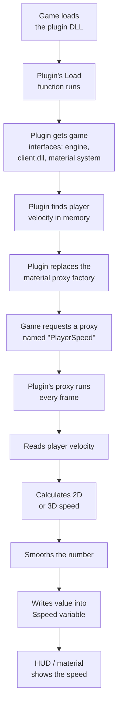

# Architecture

This document explains how the plugin works on the inside, step by step, in plain language.

## Big picture

The plugin is a DLL that the game loads as a **server plugin**. Once loaded, it hooks into the game's material system so it can feed a live speed number into any material that asks for it, through a value called `$speed`.

## Step by step

### 1. Plugin is loaded

Left 4 Dead 2, through Metamod:Source or the engine directly, loads the DLL and calls `CreateInterface`, which hands back the plugin object (`CPlugin`).

### 2. Plugin connects to the game

Inside `Load()`, the plugin grabs a few interfaces from the game so it can talk to it:

- **Engine client interface** — lets the plugin ask "who is the local player?"
- **Client DLL interface** — lets the plugin look at the list of game classes (like `CTerrorPlayer`)
- **Client entity list** — lets the plugin get the actual player entity object
- **Material system interface** — lets the plugin plug into how materials/shaders get their values

### 3. Finding the velocity in memory

The player's velocity (`m_vecVelocity`) is stored somewhere inside the player object, but the exact memory position (offset) can change between game updates. So the plugin:

1. Looks through the game's network tables to find `m_vecVelocity` and calculates its offset automatically.
2. If that fails, it falls back to a known hardcoded offset as a safety net.
3. If it still cannot find it right away, it keeps retrying for a few frames after the level loads.

### 4. Taking over the material proxy factory

A **material proxy** is a small piece of code the game calls every frame to update a value used by a material, for example a HUD number or a glow effect. The plugin creates its own factory (`CProxyFactory`) and tells the game to use it instead of the original one.

- If the game asks for a proxy called `"PlayerSpeed"`, the plugin's own proxy (`CSpeedProxy`) is used.
- For every other proxy name, the request is passed through to the original factory, so nothing else in the game breaks.

### 5. Calculating the speed every frame

Every time `CSpeedProxy::OnBind()` runs, once per frame the material is drawn:

1. It reads the player's raw velocity from memory using the offset found earlier.
2. It checks if the player is on a ladder (fast vertical movement, low horizontal movement).
   - **Not on a ladder:** use only horizontal speed (2D), ideal for bhop-style speedometers.
   - **On a ladder:** use full 3D speed instead.
3. It smooths the number so it does not jump around:
   - Very small speeds (2 or under) are treated as standing still (0).
   - Speed increases are shown immediately.
   - Speed decreases are only shown once they are big enough (3+ units), so tiny dips do not cause flicker.
4. The final number is written into the material's `$speed` variable, which the game then renders wherever that material is used.

### 6. Unloading

If the plugin is unloaded, it puts the original material proxy factory back and cleans up its own objects, so the game returns to normal.

## Key files

| File | Purpose |
|---|---|
| `dllmain.cpp` | All the plugin logic: loading, velocity lookup, proxy factory, speed calculation |
| `framework.h` | Minimal Windows header setup used by the precompiled header (`pch.h` includes it) |
| `pch.h` / `pch.cpp` | Precompiled header, speeds up compiling by pre-building common headers once |
| `l4d2_2dvel.slnx` | Visual Studio solution file, opens the whole project |
| `l4d2_2dvel.vcxproj` | Visual Studio build configuration: include paths, libraries, compiler settings |
| `hl2sdk/` | Left 4 Dead 2 SDK, provides all the game types and interfaces used above (`IServerPluginCallbacks`, `IMaterialSystem`, `IClientEntityList`, etc.) |

## Why a material proxy instead of a HUD element?

Using a material proxy means any material artist can plug `$speed` into an existing HUD material without needing new C++ code for every UI change. The plugin's only job is to keep that one number correct and up to date; how it looks on screen is entirely up to the material/shader.
